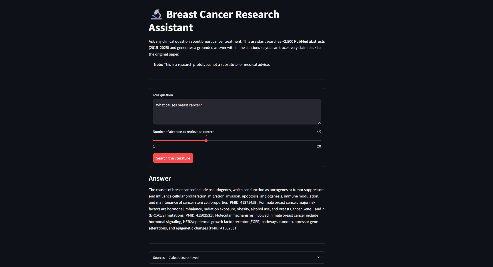
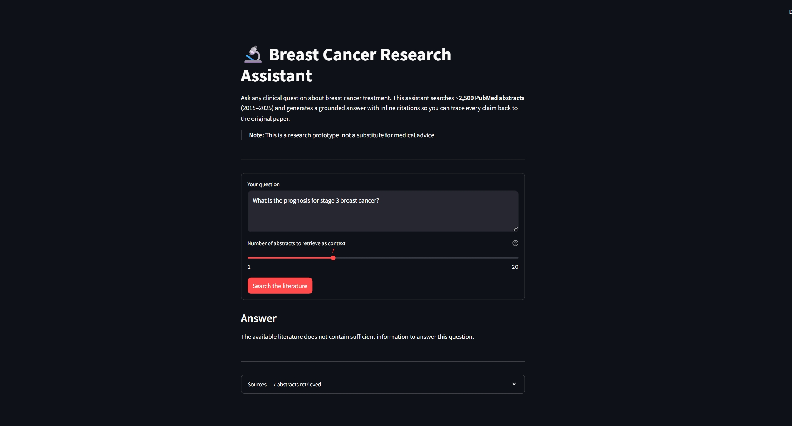
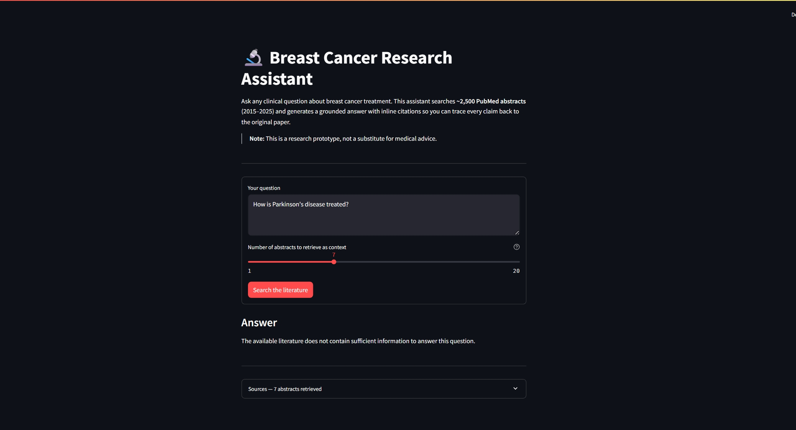

# Breast Cancer Treatment RAG

A clinical question-answering system that retrieves relevant PubMed abstracts and
generates grounded, PMID-cited answers — built so every claim traces back to a
real paper.

---

## Problem

General-purpose LLMs hallucinate on specialized biomedical questions and cannot
cite specific sources for specific claims. This project builds a
retrieval-augmented generation (RAG) system that grounds every answer in PubMed
literature and cites the source PMID inline so every claim is independently
verifiable.

> Trained on breast-cancer treatment literature; designed to abstain when the
> corpus does not support an answer.

---

## Demo

**Grounded answer with inline citations**



The system retrieves the most relevant abstracts, then instructs Gemini to cite
each claim with `[PMID: XXXXXXXX]`. Every citation maps to a real paper in the
corpus.

**Abstaining on an out-of-scope question**



When asked "What is the prognosis for stage 3 breast cancer?" — a risk-factor question, not a treatment
question — the retriever surfaces loosely related abstracts and Gemini correctly
refuses rather than confabulating an answer.

**Abstaining on an off-topic question**



Questions outside the domain entirely produce no useful context, and the model
returns the explicit refusal string rather than speculating.

---

## Architecture

```
Offline (run once)
──────────────────
Bio.Entrez (PubMed)
  └── 2,500 abstracts, 2015–2025, MeSH: breast neoplasms / therapy
        └── all-MiniLM-L6-v2 → 384-d embeddings → Chroma (HNSW index)


Online (per request)
─────────────────────
User question
    │
    ├─── Dense retrieval ──── embed query → Chroma ANN search
    │                         top-20 by cosine similarity
    │
    └─── Sparse retrieval ─── BM25 keyword search (in-memory index)
                              top-20 by TF-IDF score
         │
         ▼
    Merge + deduplicate candidates (up to 40 unique docs)
         │
         ▼
    Cross-encoder reranker (ms-marco-MiniLM-L-6-v2)
    Scores each [query, abstract] pair; returns top-k by logit
         │
         ▼
    Gemini (gemini-2.5-flash)
    Prompted to cite [PMID: XXXXXXXX] per claim;
    instructed to abstain if context is insufficient
         │
         ▼
    FastAPI  POST /query  →  Streamlit UI
```

Dense retrieval captures semantic similarity ("HER2-targeted therapy" ≈
"trastuzumab"); BM25 catches exact keyword matches that embeddings can miss
("cardiotoxicity"). The cross-encoder reranks the merged pool with full
cross-attention between query and document — more accurate but too slow to run
over the whole corpus, so it only scores the small candidate pool.

---

## Tech Stack

| Tool | Role |
|------|------|
| `sentence-transformers` (`all-MiniLM-L6-v2`) | Dense embeddings — 384-d, fast on CPU, good general quality |
| `chromadb` | Persistent vector store with HNSW approximate nearest-neighbour search |
| `rank-bm25` | In-memory BM25 index for keyword-based sparse retrieval |
| `sentence-transformers` (`ms-marco-MiniLM-L-6-v2`) | Cross-encoder reranker, fine-tuned on MS MARCO passage ranking |
| `google-generativeai` (Gemini) | LLM that synthesises the final grounded, cited answer |
| `fastapi` + `uvicorn` | Async REST backend; synchronous endpoint runs in thread pool to avoid blocking |
| `streamlit` | Thin web UI that calls the API and renders clickable PMID links |
| `biopython` | `Bio.Entrez` — fetches and parses PubMed XML records |
| `python-dotenv` | Loads secrets from `.env` so they never appear in source code |

---

## Evaluation

Retrieval evaluated on **14 hand-labeled questions** with ~5–7 relevant PMIDs
each, comparing the dense-only baseline against the full hybrid + reranking
pipeline.

| Metric     | Dense  | Hybrid + Rerank |
|------------|--------|-----------------|
| Hit@5      | 0.929  | 0.929           |
| Hit@10     | 1.000  | 1.000           |
| Recall@5   | 0.312  | 0.302           |
| Recall@10  | 0.541  | 0.493           |
| MRR        | 0.678  | 0.631           |

**Faithfulness:** cited PMIDs were verified against retrieved sources by manual
spot-check on representative questions.

**Interpretation**

- **Hit@k and MRR are the primary metrics.** Hit@10 = 1.000 means the correct
  abstract was always in the top 10; MRR = 0.678 (dense) means the first
  relevant result appeared around rank 1–2 on average.

- **Recall@k is mathematically capped.** Each question has ~5–7 relevant docs.
  Recall@5 can never exceed 5/7 ≈ 0.71 even with a perfect retriever; the
  numbers here reflect that ceiling, not a retrieval failure.

- **Hybrid did not outperform dense on this set.** The most likely reasons:
  the difference is within noise for n=14 with wide standard deviations, and
  the cross-encoder was fine-tuned on general web search (MS MARCO), not
  biomedical text, so it does not reliably reorder medical abstracts better
  than cosine similarity already does. A biomedical reranker (e.g.
  PubMedBERT-based) is the natural next experiment.

---

## How to Run

**Prerequisites:** Python 3.10+, a free [Google Gemini API key](https://aistudio.google.com/app/apikey).

**1. Clone and create a virtual environment**

```bash
git clone https://github.com/sumitja24iitk/breast-cancer-rag.git
cd breast-cancer-rag

python -m venv venv
# Windows
venv\Scripts\activate
# macOS / Linux
source venv/bin/activate

pip install -r requirements.txt
```

**2. Add your API key**

```bash
cp .env.example .env
# Open .env and set GOOGLE_API_KEY=your_key_here
```

**3. Ingest PubMed abstracts** *(one-time, ~5 min)*

```bash
python src/ingest.py    # → data/abstracts.json  (~2,500 records)
```

**4. Embed and index** *(one-time, ~3 min on CPU)*

```bash
python src/index.py     # → chroma_db/
```

**5. Start the API**

```bash
uvicorn api.main:app --reload
# Swagger UI at http://127.0.0.1:8000/docs
```

**6. Start the UI** *(separate terminal)*

```bash
streamlit run app.py
# Opens http://localhost:8501
```

**7. Run the evaluation harness** *(optional)*

```bash
python src/eval.py                 # both modes, k = 5 and 10
python src/eval.py --faithfulness  # also calls Gemini per question (slow)
```

---

## Project Structure

```
breast-cancer-rag/
├── src/
│   ├── ingest.py       # Phase 1 — fetch ~2,500 PubMed abstracts via Entrez
│   ├── index.py        # Phase 2 — embed with MiniLM, persist in Chroma
│   ├── retrieve.py     # Phase 3/7 — dense retrieval, BM25, hybrid, reranking
│   ├── generate.py     # Phase 4 — Gemini call with grounding prompt
│   ├── rag.py          # Phase 4 — orchestrate retrieve → generate
│   └── eval.py         # Phase 8 — Hit@k, Recall@k, MRR, faithfulness
├── api/
│   └── main.py         # Phase 5 — FastAPI app (POST /query, GET /health)
├── app.py              # Phase 6 — Streamlit UI
├── eval/
│   └── questions.json  # 14 hand-labeled evaluation questions
├── docs/               # Screenshots used in this README
├── data/               # gitignored — abstracts.json written here by ingest.py
├── chroma_db/          # gitignored — Chroma HNSW index written here by index.py
├── .env.example
└── requirements.txt
```

---

## Limitations and Future Work

- **Research prototype, not a clinical tool.** Answers are grounded in published
  abstracts but the system can still mis-read or over-generalise a finding.
  Always verify claims with the primary literature and a qualified clinician.

- **Small evaluation set.** 14 labeled questions is enough to compare retrieval
  modes directionally but not enough to claim statistical significance. Paired
  t-tests would require at least ~50 questions.

- **Multiple relevant docs per question cap recall@k.** Questions with 7 gold
  PMIDs have a theoretical Recall@5 ceiling of 5/7 ≈ 0.71; reported numbers
  reflect that, not retrieval quality alone.

- **Corpus scope creep.** The MeSH query `"breast neoplasms" AND "therapy"` pulls
  a small number of comorbidity and supportive-care papers alongside pure
  treatment studies. A tighter query or manual curation would improve precision.

- **Potential upgrades:**
  - Biomedical embeddings and reranker (PubMedBERT) for better domain specificity
  - Full-text ingestion via PMC Open Access to complement abstracts
  - `pgvector` + PostgreSQL to replace Chroma for production deployments
  - Docker Compose to bundle the API and UI into a single deployable unit
  - Drift monitoring: flag when retrieved context scores fall below a threshold

---

## License

[MIT](LICENSE)

---

## Acknowledgements

Corpus sourced from [PubMed](https://pubmed.ncbi.nlm.nih.gov/) via the
[NCBI E-utilities API](https://www.ncbi.nlm.nih.gov/books/NBK25499/).
No PubMed data is stored in this repository; `src/ingest.py` fetches it at
run time in accordance with NCBI's terms of use.
